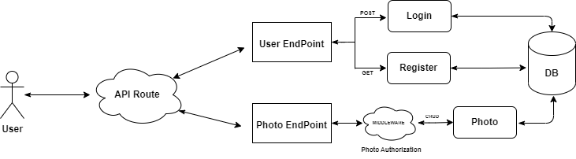

# Final Project Restful API with Golang - **Virtual Internship Bank BTPN Syariah X Rakamin** 

<hr />
<br />

## Tentang API
<p style="margin-left: 10px">
    Ini merupakan <i>Restful API</i> yang di bentuk untuk memenuhi tugas akhir pada <b>Virtual Internship - Bank BTPN Syariah X Rakamin</b>. Disini kami di uji terkait dengan Bahasa Pemrograman <i>Golang</i> yang merupakan bahasa pemrograman baru bagi saya, dengan membuat sebuah  <i>Restful API</i> dengan requirement yang telah di tentukan sebelumnya.  <i>Restful API</i> ini terdiri dari dua Endpoint, yaitu User Endpoint (Login & Register) dan Photo Endpoint. Gambaran lebih detail terkait dengan <i>System Design</i> dan <i>API Specification</i> nya dapat di lihat pada bagian selanjutnya.
</p>

## Set up
<p style="margin-left: 10px">
    Telah di sediakan file  <b>Makefile</b> yang berfungsi untuk menjalankan beberapa init script terkait dengan <i>Golang Restful API</i> nya
</p>

- postgresup (untuk melakukan pull postgres docker image nya dan set up volume untuk persistance storage)
- postgresdown (untuk menghentikan proses docker image postgres yang sedang berjalan pada suatu container dan remove cache container nya)
- psql (untuk memulai interactive shell dari container postgres yang sedang berjalan. Hal ini bermanfaat jika ingin melakukan debugging ke dalam database -> table postgres nya)

`Contoh perintah : make <target> | make postgresup`

<p style="margin-left: 10px">
    Berikut adalah tatacara untuk men-setup docker image <i>Golang Restful API</i> dan <i>PostgreSQL</i> secara cepat. Agar dapat secara langsung me-running <i>Restful API</i> nya.
</p>

- `make build` | untuk mem-build image dari <i>Golang Restful API </i> nya
- `make run` | me-running image Golang dan Postgres nya secaras otomatis.

That's it, Restful API nya sudah bisa di testing sekarang, Enjoy :)

<br />

## How to Use 
<p style="margin-left:10px">
    There are several stage in this <i>Restful API</i> (Development, Testing & Production)
</p>

- Development 
    - to running development stage you can use this configurations
        - change DB_HOST to localhost
        - change DB_PORT to 5433
        - change STAGE to development
        - run `make postgresup` in your terminal
        - run `go run main.go` in your terminal
- Testing
    - to running testing stage you can use this configurations
        - change DB_HOST to localhost
        - change DB_PORT to 5433
        - change STAGE to testing
        - run `make test` in your terminal
- Production
    - to running production (with container) stage you can use this configurations
        - you dont need to configure .env files, because for demonstration purpose, Iam already Hard-Code the ENV Variable in Dockerfile
        - run `make build` in your terminal
        - run `make run` in your terminal

`If container or image already created before, you can use make delete_container or make delete_image command in Makefile`


## System Design
<br />
<p align="center">
    
</p>

<p style="margin-left:10px">
    User akan di berikan dua <i>Endpoint</i>, yakni <i>User Endpoint</i> dan <i>Photo Endpoint</i>. Dapat di lihat <i>Flow Process</i> dari <i>Restful API</i> yang telah di buat. User akan mengirimkan Request kepada <i>Restful API</i> terkait, lalu akan di teruskan kepada <i>Endpoint</i> yang telah di tuju sebelumnya. Jika <i>Endpoint</i> User, maka akan di suguhkan oleh dua route, yakni Login dan Register. Jika Endpoint Photo, maka akan di suguhkan sebuah <i>CRUD Method</i>. Namun untuk mengubah dan menghapus photo di butuhkan <i>Permission</i> khusus, yakni hanya User yang membuat / mengupload photo tersebut. <i>Middleware</i> akan mem-filter siapa saja User yang dapat melakukan perubahan dan penghapusan terkait dengan photo terkait. 
</p>

<br />

## API Spec

### Authentication
<p style="margin-left:10px">
    Semua <i>API Endpoint</i> harus menggunakan <i>Authentication</i> ini.
</p>

Request :
- Header : 
    - Authorization : JWT Token


### User Register :

Request :
- Method : POST
- Endpoint : `/api/v1/users/register`
- Header :
    - Content-Type : application/json
    - Accept : application/json
- Body :
    ```json
        {
            "id" : "primary key, required",
            "username" : "required",
            "email" : "unique, required",
            "password" : "required, min-length: 6",
            "photo" : "Many-to-One, CASCADE | optional",
        }
    ```

Response :

```json
    {
        "code" : "number",
        "status" : "string",
        "data" : {
            "id" : "string",
            "email" : "string",
            "username" : "string",
            "created_at" : "timestamp"
        }
    }
```

### User Login

Request :

- Method : POST
- Endpoint : `/api/v1/users/login`
- Header : 
    - Accept: application/json
- Body:
    ```json
        {
            "email" : "string",
            "password" : "string"
        }
    ```

Response :

```json
    {
        "code" : "number",
        "status" : "string",
        "data" : {
            "token" : "string"
        }
    }
```

### Photo 
- Method : GET 
- Endpoint : `/api/v1/photo`
- Header : 
    - Accept : application/json
    - 
Response :

```json
    {
        "code" : "number",
        "status" : "string",
        "data" : {
            "id" : "uint",
            "title" : "string",
            "photo_url" : "string",
            "caption" : "string",
            "user_id" : "uint",
            "user" : "Many-to-One"
        }
    }
```

- Method : POST 
- Endpoint : `/api/v1/photo`
- Header : 
    - Accept : application/json
    - Authorization : JWT-Token

Request :
```json
    {
        "title" : "string",
        "photo_url" : "string",
        "caption" : "string | optional",
        "user_id" : "uint",
    }
```

Response :

```json
    {
        "code" : "number",
        "status" : "string",
        "data" : {
            "id" : "uint",
            "title" : "string",
            "photo_url" : "string",
            "user_id" : "uint",
            "user" : "Many-to-One",
            "created_at" : "timestamp",
        }
    }
```

- Method : PUT 
- Endpoint : `/api/v1/photo`
- Header : 
    - Accept : application/json

Request :
```json
    {
        "user_id" : "uint",
    }
```

Response :

```json
    {
        "code" : "number",
        "status" : "string",
        "data" : {
            "id" : "uint",
            "title" : "string",
            "photo_url" : "string",
            "user_id" : "uint",
            "user" : "Many-to-One",
            "updated_at" : "timestamp",
        }
    }
```

- Method : DELETE 
- Endpoint : `/api/v1/photo`
- Header : 
    - Accept : application/json

Request :
```json
    {
        "user_id" : "uint",
    }
```

Response :

```json
    {
        "code" : "number",
        "status" : "string",
        "data" : {
            "message" : "string"
        }
    }
```